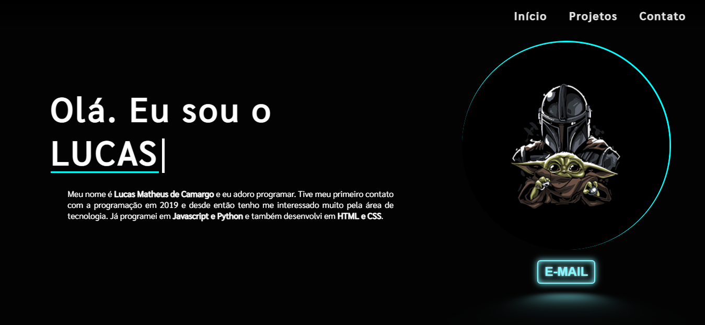

<h1 align="center"> 
    <a href="https://portfolio-lucas-matheus.vercel.app/">Currículo 👾</a>
</h1>

✨ Currículo desenvolvido com <strong>HTML5</strong>, <strong>CSS3</strong> e <strong>JAVASCRIPT</strong> ✨

<!-- Status do Projeto -->
<h4 align="center"> 
	⚙️  Currículo 🌌 Em construção...  ⚙️
</h4>

### 🛠 Tecnologias

Foram usadas As seguintes ferramentas na construção do projeto:

- [HTML5]
- [CSS3]
- [JavaScript](https://www.javascript.com/)
- [Biblioteca ScrollReveal JS](https://scrollrevealjs.org/)

### Autor

<a href="">
 
  
 <b>Lucas Matheus</b>
</a> 